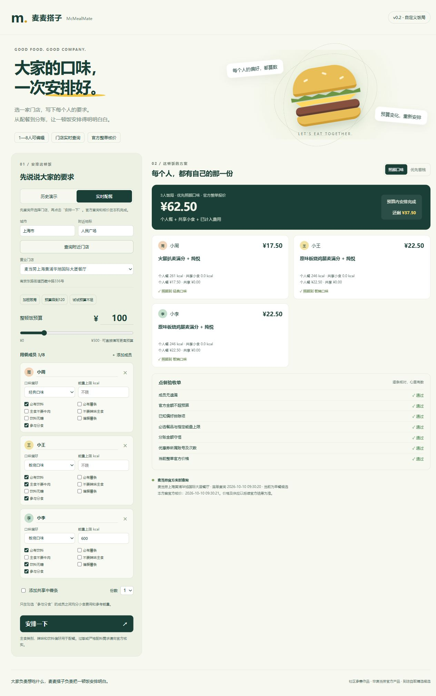

# 麦麦搭子 McMealMate

**大家负责想吃什么，麦麦搭子负责把一顿饭安排明白。**

v0.2 已支持浏览器自定义成员、选择门店、实时读取菜单与官方整单核价。早餐与正餐根据当前供应生成精选候选。

四个人一起点餐：有人不吃牛肉，有人要无糖饮料，有人想要薯条，还得控制整顿饭的预算。麦麦搭子把这些要求转成可检查的约束，通过麦当劳中国 MCP 查询菜单、营养和官方价格，给出两套配餐方案、每人分账及点餐验收单。

面向一起吃饭的同事、朋友、小型家庭，以及需要多人配餐的 AI 助手。社区原创参赛作品，使用 AI 编程辅助开发，非麦当劳官方产品。



## 已完成的功能

- 1 至 8 人独立需求：主食肉类偏好、饮料选择、必选餐品、软偏好及用户指定的能量上限。
- 两套方案：优先照顾口味；在已提供候选内优先省钱。两者都保留硬性要求。
- 金额用整数分计算，共享小食按食用成员分摊，尾差有固定规则。
- 无可行方案时明确指出预算下界或冲突，不会漏掉某个人。
- 识别需另购会员卡的候选价，支持已核实的券归属和次数约束；内置现场适配器当前使用无券方案。
- 最终整单经 `calculate-price` 核验；报价超预算时验收失败。
- 浏览器可增删1至8位成员，编辑姓名、口味偏好、饮料/薯条要求、主食排除项、能量上限及共享小食食用成员。
- 页面可搜索城市和地标附近的营业门店，选择门店后真实调用官方 MCP 查询菜单、详情、营养和整单报价。
- 查询进度可见；需求改变后标记旧结果。菜单最多缓存5分钟，新方案每次重新官方核价。
- 提供历史演示与实时配餐两种模式、可被 AI 助手加载的 [SKILL.md](SKILL.md)、纯 Python 命令行，无第三方运行依赖。

## 五分钟运行

需要 Python 3.10 或更高版本：

```bash
git clone https://github.com/panchao9527/mcmeal-mate.git
cd mcmeal-mate
python -X utf8 -m mcmeal plan
python -X utf8 -m mcmeal serve
```

浏览器打开 `http://127.0.0.1:8765`。默认进入历史演示，可增删成员、编辑偏好、填写预算及共享小食，再查看方案和验收结果。

历史模式使用 **2026-10-09 上海黄浦华旭国际大厦餐厅的真实 MCP 历史现场快照**，离线计算，当前整单价格标记“待核实”。切换实时模式后，需要本机服务已配置 Token，并选择营业门店。示例人物均为虚构角色。

## 真实 MCP 接入

在 [麦当劳开放平台](https://open.mcd.cn/mcp) 按官方流程申请 Token，只在本机设置环境变量。不要把 Token 放进源码、截图、提交记录或公开对话。

PowerShell：

```powershell
$env:MCD_MCP_TOKEN = Read-Host '麦当劳 MCP Token' -MaskInput
python -X utf8 -m mcmeal serve
```

页面使用步骤：

1. 点击“实时配餐”，填写城市和附近地标，点击“查询附近门店”。
2. 从官方返回的营业门店中选择一家。
3. 添加或删除成员，设置每人的要求和整顿饭预算。共享小食只分给勾选“参与分食”的人。
4. 点击“安排一下”，等待官方查询和试算。结果显示当前核价时间、每人金额及逐条验收。
5. 修改预算、成员、口味或策略后，再点击“安排一下”。查询期间改变需求时，旧结果不会被作为新方案展示。

同一时间只执行一条实时查询。首次加载菜单可能约需一分钟，页面显示当前阶段。当前门店没有所需餐品时会报告冲突。例如早餐时段不售卖中薯条时，用户需要自行调整薯条要求或换时段、门店，系统不擅自替换硬性要求。

也可运行命令行：

```powershell
python -X utf8 -m mcmeal refresh --city 上海市 --keyword 人民广场
python -X utf8 -m mcmeal quote --request examples/request.json --menu local-runs/menu.json
```

`-MaskInput` 需要 PowerShell 7。其他终端通过本机环境变量管理方式设置 `MCD_MCP_TOKEN`。还可通过 `serve --token-file` 指定仓库之外的本机 UTF-8 Token 文件。服务只绑定 `127.0.0.1`，不向浏览器返回 Token，不接收网页提供的认证材料。生成的 `local-runs/` 已被 Git 忽略。

命令行 `refresh` 自动选择搜索结果中首家营业门店用于试算；`--store-code` 可指定门店。页面必须由用户选择门店。内置适配器覆盖 **到店自取、早餐/正餐精选候选、无券配餐**，不遍历整个菜单。候选包括单点主食、主食加水、默认/无糖饮料套餐和当前可用中薯，数量随门店和时段变化。结构或营养字段变化时保留未知或停止提示。

支持通用 Skill 的客户端可将整个仓库作为 `mcmeal-mate` 技能目录加载，读取根目录 `SKILL.md`。在 WorkBuddy 等支持 MCP 的客户端参考 [mcp-config.example.json](mcp-config.example.json) 连接官方服务；环境变量替换语法以客户端实际支持为准，示例占位符不是有效 Token。

## 使用示例

> 我们四个人加班吃饭，总预算150元。我想要汉堡、薯条和饮料，小王主食不要牛肉，小李饮料选无糖，个人餐和均分小食合计不超过600 kcal，小陈想吃辣。再加一份四人共享中薯，分别多少钱也算清楚。

AI 助手按 Skill 将自然语言转为请求 JSON，再查官方数据、运行规划、核对报价。浏览器可独立编辑结构化需求并完成实时查询；任意自然语言理解由承载 Skill 的 AI 助手完成。

2026-10-09 现场整单试算，含一份共享中薯：

| 需求 / 策略 | 官方整单金额 | 结果 |
| --- | ---: | --- |
| 150 元，照顾口味 | 135.00 元 | 4 人都有个人餐，余 15.00 元 |
| 改为 120 元，照顾口味 | 114.50 元 | 保留硬性要求，说明放弃的软偏好 |
| 150 元，候选内省钱优先 | 113.00 元 | 比口味方案少 22.00 元 |
| 改为 80 元，离线约束验证 | 无方案 | 报告金额下界，不漏掉成员 |

金额和供应仅代表该门店、该时刻、该场景，不代表全国统一价格或后续报价。完整结果见 [现场示例](examples/quoted-15000-preference.json) 和 [验证记录](docs/VALIDATION.md)。

## 为什么有用

把“所有人都照顾到”做成可验收的结果：预算变化时保留其他需求，缺信息就待核实，共享费用算到分，软偏好没有满足也会讲明白。

约束搜索在给定候选集合内比较。默认最多 200,000 个搜索节点；未完成搜索会说明局限，不宣称全菜单最优。营养数据按官方标准份量估算，共享小食按成员均分，不代表个人实际食用量。肉类分类用于口味偏好，不能用于过敏、交叉接触或严格配料安全判断。

## 验证与参赛

```bash
python -X utf8 -m unittest discover -s tests -v
```

自动测试覆盖预算、未知信息、优惠券归属与次数、数量限制、共享能量、分账守恒、官方报价超预算、8人搜索、门店选择、缓存与重新核价、查询并发限制、早餐餐品冲突、本机接口边界和只读调用。执行数量和现场记录见 [验证报告](docs/VALIDATION.md) 与 [MCP_INTEGRATION.md](MCP_INTEGRATION.md)。

本项目参加 [麦当劳程序员创意开发大赛](https://github.com/M-China/mcd-developer-innovation-challenge)，已提交 [报名申请 Issue #82](https://github.com/M-China/mcd-developer-innovation-challenge/issues/82)，官方已[回复作品成功参赛](https://github.com/M-China/mcd-developer-innovation-challenge/issues/82#issuecomment-6079533897)。报名及排名时间为北京时间 2026-10-09 10:30 至 2026-10-25 23:59。当前开发使用 Codex，未申报 WorkBuddy 专项开发奖励，未提交虚构的 WorkBuddy 对话记录。

原创代码采用 [MIT License](LICENSE)。官方声明保持原文；官方 MCP 使用条款及数据、商标权利不因本项目许可证而改变。
